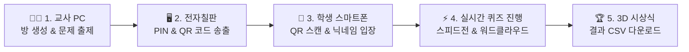

# ⚡ 클래스 라이브 퀴즈 (Class Live Quiz)

> **교실 전자칠판, 교사 PC, 학생 스마트폰을 실시간 클라우드 DB로 이어주는 반응형 퀴즈 & 의견 수렴 웹 플랫폼**  
> 설치 및 서버 구성 0초! 카훗(Kahoot) / 퀴즈앤(QuizN) 스타일의 3대 뷰(대형 송출/교사 제어/학생 응답) 무설치 스마트 교육 도구입니다.


## 📌 개요 및 핵심 요약 (Overview)

### 1. 한 줄 설명 (One-Line Summary)
> **교실 전자칠판(대형 송출), 교사 PC(퀴즈 제어), 학생 스마트폰(QR 1초 응답)이 0.1초 실시간 클라우드 DB로 연동되는 무설치·무과금·개인정보 안심 3D 반응형 참여형 퀴즈 & 브레인스토밍 플랫폼**

---

### 2. 교육적 의도 (Educational Intent)
- **모든 학생의 능동적 수업 참여 (Universal Participation)**: 손들고 발표하기를 주저하던 내성적인 학생들도 스마트폰 QR 1초 스캔을 통해 부담 없이 자발적으로 정답과 의견을 제출하도록 설계했습니다.
- **목적에 맞춘 융합형 평가 (Formative Assessment & Idea Gathering)**:
  - **지식 점검 (OX / n지선다 / 단답형)**: 카훗(Kahoot) 스타일의 정밀 스피드 가산점과 라이브 리더보드로 학습 몰입도와 긴장감을 높입니다.
  - **생각 공유 (워드클라우드 / 포스트잇)**: 무제한 수동 마감 모드로 학생들이 시간 압박 없이 깊이 고민하고 아이디어를 나눌 수 있습니다.
- **개인정보 침해 없는 안심 환경**: 학번, 이름, 연락처 등 민감 개인정보를 일절 수집·저장하지 않는 일회성 동물 아바타·닉네임 시스템으로 교사가 개인정보 유출 우려 없이 안심하고 활용할 수 있습니다.

---

### 3. 예상되는 현장 변화 (Classroom Impact)
- **수업 몰입도와 열기의 극대화**: 문제 마다 전환되는 Top 5 순위표와 최종 3D 포디움 시상식 연출로 학생들의 발표 참여 욕구와 집중도가 획기적으로 상승합니다.
- **실시간 형성평가 및 맞춤형 피드백**: 전자칠판 대형 화면으로 정답률과 실시간 학생 응답 분포를 0.1초 만에 확인하여 교사가 즉각적인 재설명이나 맞춤형 지도 피드백을 제공할 수 있습니다.
- **학습 데이터의 자동 보관**: 퀴즈 완료 시 클릭 한 번으로 CSV 엑셀 결과를 다운로드하여 학생별 성적과 제출 내용을 소장·분석할 수 있습니다.
- **기기 제약 없는 수업 혁신**: 교사 PC, 전자칠판, 학생 BYOD 스마트폰(iOS/Android) 구분 없이 앱 설치나 가입 없이 URL 하나로 수업을 시작할 수 있습니다.

---

### 4. 자세한 설명 (Detailed Feature Overview)
- **3대 뷰(3-Way View) 실시간 동기화 아키텍처**:
  - 교사 컨트롤 모드: 방 생성, 문항 자유 편집/삭제, 스피드전 제어, 중간 점수 공개 및 시상식 진행
  - 전자칠판 디스플레이 모드: 4종 교실 테마(TV, 초록 칠판, 대리석, 우드락) 지원, 대형 PIN/QR코드, 타이머, 3D 시상식 송출
  - 학생 모바일 패드: QR 스캔 즉시 12종 귀여운 동물 아바타 및 닉네임 선택, 1인 1회 중복 방지 터치 패드
- **모바일 100% 검증 이중화 엔진**: WebSocket 연결과 HTTPS REST API 조회를 이중 탑재하여 교내망 AP Isolation(기기간 직접 통신 차단)이나 모바일 Safari/네이버 앱 인앱 브라우저 신호 차단 환경에서도 100% 무방비로 안정 동작합니다.
- **오프라인 Web Audio 사운드 엔진**: 외부 MP3 음원 차단 사고를 방지하기 위해 브라우저 자체 음파 합성(Web Audio API) 기술로 효과음(카운트다운 틱, 정답 팡파르 등)을 100% 오프라인 생성합니다.

---
---

## 🌟 주요 특징 (Key Features)

1. **무설치 3대 뷰(3-Way View) 실시간 동기화**
   - **교사 모드 (Teacher Control)**: 퀴즈 방 생성, 문항 출제 및 편집, 게임 진행/제어, 랭킹 및 시상식 주도
   - **전자칠판 디스플레이 (Host Display)**: 교실 대형 화면에 대형 PIN 번호, QR코드, 실시간 응답 차트, 카운트다운 타이머, 3D 포디엄 송출
   - **학생 모바일 패드 (Student Response Pad)**: 스마트폰 QR 스캔 한 번으로 1초 입장, 12종 귀여운 동물 아바타 및 닉네임 설정, 1인 1회 응답 터치 패드

2. **다양한 6종 문항 지원**
   - **O/X 참거짓**: 직관적인 레드/블루 대형 2지 터치 패드
   - **선다형 (2~5지선다)**: 보기 개수 자동 조절(3지/4지/5지선다) 지원
   - **단답형**: 키보드 입력 포커스 보존으로 모바일 자판 닫힘 버그 100% 방지
   - **실시간 워드클라우드**: 시간제한 없이 학생들의 키워드 의견을 대형 화면에 구름 형태로 시각화 (`⏱️ 무제한 의견 수렴`)
   - **포스트잇 브레인스토밍**: 황색 브레인스토밍 메모 보드로 자유로운 생각 수렴 (`⏱️ 무제한 의견 수렴`)

3. **스피드전 점수 산출 & 카훗 스타일 연출**
   - 정답 입력 시간에 따른 정밀 스피드 가산점 자동 집계
   - **⚡ 점수 2배 이벤트 문항** 지정 옵션
   - 문항 간 **📊 중간 점수 랭킹 (Top 5)** 순위표 송출
   - 퀴즈 완료 시 **🏆 3D 포디움 시상식** (3위 ➔ 2위 ➔ 1위 애니메이션 및 나팔 소리 팡파르 연출)
   - 전체 학생 성적 및 응답 기록 **📥 CSV 엑셀 파일 내보내기** 지원

4. **교실 분위기에 맞춘 4종 디스플레이 테마**
   - 📺 **스마트 TV 테마**: 모던하고 깔끔한 다크 스타일 (기본)
   - 🧹 **초록 칠판 테마**: 아날로그 교실의 칠판과 분필 감성 연출
   - 🏛️ **깔끔 대리석 테마**: 고급스럽고 세련된 프리미엄 퀴즈쇼 분위기
   - 🪵 **우드락 보드 테마**: 따뜻한 코르크 게시판 감성의 브레인스토밍 분위기

5. **모바일 100% 검증 호환성 & 개인정보 안심 가드**
   - 모바일 Safari, 네이버/카카오/인앱 브라우저에서도 백업 REST API 이중화 통신으로 0.1초 즉시 연결
   - 학생 이름/학번 등 민감 개인정보 0건 수집 (일회성 닉네임 사용, 세션 만료 시 자동 정제)
   - 방을 처음 작성한 교사 PC(로컬)에서만 수정/삭제가 가능한 **🔒 편집 보안 가드** 탑재

---

## 🚀 사용 및 시작 방법 (Getting Started)

### 1. 웹 브라우저에서 즉시 실행 (무설치)
본 프로젝트는 추가 빌드 도구 설치 없이 단일 파일로 동작합니다.
- `index.html` (또는 `공유용/index.html`) 파일을 더블클릭하여 웹 브라우저(Chrome, Edge, Safari 등)로 여시면 바로 시작됩니다.

### 2. GitHub Pages / Vercel 무료 배포
1. 본 리포지토리를 복제(Fork / Clone)합니다.
2. GitHub Pages 설정에서 `main` 브랜치를 지정하거나, [Vercel](https://vercel.com)에 연결하면 10초 만에 나만의 온라인 URL이 생성됩니다.

---

## 📖 교사 & 학생 온보딩 가드 (Step-by-Step Guide)



### Step 1. 퀴즈 방 생성 및 출제 (교사 PC)
1. 메인 화면에서 **[👨‍🏫 교사 모드]** ➔ **[새 퀴즈 방 만들기]** 버튼을 클릭합니다.
2. 우측 상단의 **[📝 문제 출제 / 편집]**을 눌러 OX, 선다형, 단답형, 워드클라우드, 포스트잇 문항을 자유롭게 추가/수정하고 저장합니다.

### Step 2. 전자칠판 화면 송출 (교실 대형 화면)
1. 교실 전자칠판 PC에서 **[🖥️ 전자칠판 모드]**를 선택한 후, 6자리 **PIN 번호**를 입력하고 접속합니다.
2. 대형 화면에 생성된 **QR코드**와 **PIN 번호**가 송출됩니다.
3. 우측 상단 드롭다운에서 **🧹 초록 칠판 / 🪵 우드락 보드** 등 마음에 드는 화면 테마를 선택합니다.

### Step 3. 학생 스마트폰 입장
1. 학생들은 스마트폰 카메라로 전자칠판의 **QR코드**를 스캔하거나 주소창에 PIN 번호를 입력합니다.
2. 12가지 귀여운 **동물 아바타**와 **닉네임**을 선택하고 **[퀴즈 대기실 입장]**을 누릅니다.

### Step 4. 퀴즈 진행 및 의견 수렴
1. 교사 화면에서 **[🚀 퀴즈 시작]**을 누르면 실시간 퀴즈가 구동됩니다.
2. **OX / 객관식 / 단답형**: 제한시간 카운트다운 동안 스피드에 따라 점수가 산출됩니다.
3. **워드클라우드 / 포스트잇**: 시간제한 없이 학생들의 의견을 모은 후 교사가 **[⏹️ 응답 마감 및 의견 공유]**를 누릅니다.
4. 문항 간 **[📊 중간 순위 보기 (1~5위)]** 버튼으로 흥미 진진한 리더보드를 공유합니다.

### Step 5. 시상식 및 기록 저장
1. 모든 문항이 종료되면 3위부터 1위까지 차례로 등장하는 **🏆 3D 포디움 시상식**이 펼쳐집니다.
2. **[📥 퀴즈 결과 CSV 다운로드]** 버튼을 누르면 학생별 점수와 제출 답안을 엑셀 파일로 바로 보관할 수 있습니다.

---

## 🛠️ 개발자 복제 및 프로젝트 구조 (Repository Structure)

```bash
# 1. 깃허브 리포지토리 복제
git clone https://github.com/ygywam/realtimeQuiz.git

# 2. 해당 폴더로 이동
cd realtimeQuiz
```

### 폴더 및 파일 구조
```
projects/실시간퀴즈/
├── index.html            # 브라우저 실행용 메인 단일 HTML (CSS/JS 내장)
├── app.js                # 통합 비즈니스 로직 및 뷰 컨트롤러
├── style.css             # 4종 테마 및 반응형 레이아웃 스타일시트
├── 공유용/                # 완성본 배포 배포용 폴더 (index.html, app.js, style.css)
├── src/                  # 모듈화 컴포넌트 및 엔지니어링 소스
│   ├── components/       # hostDisplay.js, teacherAdmin.js, studentPad.js
│   ├── engine/           # firebase.js, quizEngine.js
│   └── assets/           # style.css
├── docs/                 # TASKS.md, DECISIONS.md (프로젝트 결정 기록)
└── PROJECT.md            # 프로젝트 명세 및 검증 규칙
```

---

## 🔒 개인정보 및 보안 (Privacy & Security)

- **Firebase 데이터베이스 보안**: 본 시스템에는 무료 실시간 클라우드 DB가 기본 연결되어 있으며, 상단 **`🟢 Firebase 실시간 DB 자동 연결됨`** 클릭 시 상세 사용 안내가 제공됩니다.
- **개인 Firebase 교체 지원**: 본인 전용 Firebase DB로 교체하고자 하는 교사는 **`⚙️ 나만의 Firebase 개인화 설정`**에서 개인 키를 안전하게 등록할 수 있습니다. (기본 내장 키는 코드 내 보안 처리되어 화면에 평문 노출되지 않습니다)

---

## ✒️ 제작자 정보 (Author)

- **만든이**: 기록조율사 서울외고 조용희
- **인스타그램**: [@Record_Tuner](https://www.instagram.com/record_tuner)
- **문의 & 제안**: 인스타그램 DM 또는 GitHub Issue를 남겨주세요!
