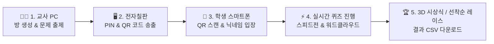

# ⚡ 클래스 라이브 퀴즈 (Class Live Quiz)

> **교실 전자칠판, 교사 PC, 학생 스마트폰을 실시간 클라우드 DB로 이어주는 반응형 퀴즈 & 선착순 게임 웹 플랫폼**  
> 설치 및 서버 구성 0초! 카훗(Kahoot) / 퀴즈앤(QuizN) 스타일의 3대 뷰(대형 송출/교사 제어/학생 응답) 무설치 스마트 교육 도구입니다.

## 📌 개요 및 핵심 요약 (Overview)

### 1. 한 줄 설명 (One-Line Summary)
> **교실 전자칠판(대형 송출), 교사 PC(퀴즈 제어), 학생 스마트폰(QR 1초 응답)이 0.1초 실시간 클라우드 DB로 연동되는 무설치·무과금·개인정보 안심 3D 반응형 참여형 퀴즈 & 선착순 게임(핀볼/구슬 롤러코스터) 플랫폼**

---

### 2. 교육적 의도 (Educational Intent)
- **모든 학생의 능동적 수업 참여 (Universal Participation)**: 손들고 발표하기를 주저하던 내성적인 학생들도 스마트폰 QR 1초 스캔을 통해 부담 없이 자발적으로 정답과 의견을 제출하도록 설계했습니다.
- **목적에 맞춘 융합형 평가 (Formative Assessment & Idea Gathering)**:
  - **지식 점검 (OX / n지선다 / 단답형)**: 카훗(Kahoot) 스타일의 정밀 스피드 가산점과 라이브 리더보드로 학습 몰입도와 긴장감을 높입니다.
  - **생각 공유 (워드클라우드 / 포스트잇 / 의견 설문)**: 무제한 수동 마감 모드로 학생들이 시간 압박 없이 깊이 고민하고 아이디어를 나눌 수 있습니다.
  - **학급 레크리에이션 (🎰 선착순 코인 낙하 레이스)**: 퀴즈 성적에 따라 지급된 코인으로 핀볼 또는 구슬 롤러코스터 서킷 레이싱을 펼치며 레크리에이션 열기를 끌어올립니다.
- **개인정보 침해 없는 안심 환경**: 학번, 이름, 연락처 등 민감 개인정보를 일절 수집·저장하지 않는 일회성 동물 아바타·닉네임 시스템으로 교사가 개인정보 유출 우려 없이 안심하고 활용할 수 있습니다.

---

### 3. 예상되는 현장 변화 (Classroom Impact)
- **수업 몰입도와 열기의 극대화**: 문제 마다 전환되는 Top 5 순위표와 3D 포디움 시상식, 그리고 핑퐁 핀볼/구슬 롤러코스터 선착순 게임 연출로 학급 전원의 집중도가 극대화됩니다.
- **실시간 형성평가 및 맞춤형 피드백**: 전자칠판 대형 화면으로 정답률과 실시간 학생 응답 분포를 0.1초 만에 확인하여 교사가 즉각적인 재설명이나 맞춤형 지도 피드백을 제공할 수 있습니다.
- **학습 데이터의 자동 보관**: 퀴즈 완료 시 클릭 한 번으로 CSV 엑셀 결과를 다운로드하여 학생별 성적과 제출 내용을 소장·분석할 수 있습니다.
- **기기 제약 없는 수업 혁신**: 교사 PC, 전자칠판, 학생 BYOD 스마트폰(iOS/Android) 구분 없이 앱 설치나 가입 없이 URL 하나로 수업을 시작할 수 있습니다.

---

## 🌟 주요 특징 (Key Features)

1. **무설치 3대 뷰(3-Way View) 실시간 동기화**
   - **교사 모드 (Teacher Control)**: 퀴즈 방 생성, 문항 출제 및 편집, 게임 진행/제어, 랭킹 및 시상식 주도
   - **전자칠판 디스플레이 (Host Display)**: 교실 대형 화면에 대형 PIN 번호, QR코드, 실시간 응답 차트, 카운트다운 타이머, 3D 포디엄 송출
   - **학생 모바일 패드 (Student Response Pad)**: 스마트폰 QR 스캔 한 번으로 1초 입장, 12종 귀여운 동물 아바타 및 닉네임 설정, 1인 1회 응답 터치 패드

2. **다양한 6종 문항 지원**
   - **O/X 참거짓**: 직관적인 레드/블루 대형 2지 터치 패드
   - **선다형 (2~5지선다)**: 보기 개수 자동 조절(3지/4지/5지선다) 및 3종 시각화(그리드, 막대, 원형 차트) 지원
   - **단답형**: 키보드 입력 포커스 보존으로 모바일 자판 닫힘 버그 100% 방지 및 재미있는 오답 익명 워드클라우드 지원
   - **무점수 의견 설문/투표 (Poll)**: 정답 유무와 무관한 단순 의견 수렴 투표 기능
   - **실시간 워드클라우드**: 시간제한 없이 학생들의 키워드 의견을 대형 화면에 구름 형태로 시각화 (`⏱️ 무제한 의견 수렴`)
   - **포스트잇 브레인스토밍**: 황색 브레인스토밍 메모 보드로 자유로운 50vh 캔버스 그림 제출 및 생각 수렴

3. **🎰 선착순 게임 2종 모드 (핀볼 vs 구슬 롤러코스터)**
   - **🎰 핑퐁 핀볼 낙하 레이스**: 5,500px 대장정 트랙에서 회전 톱니, 결승선 핑퐁 리바운드 날개, 15종 튕김 범퍼 및 충돌 물리 연산으로 선착순 순위를 결정합니다.
   - **🔮 구슬 롤러코스터 트랙 레이스**: 110px 폭의 아스팔트 연속 서킷 도로와 U턴 코너 곡선 도로, 갓길 네온 가드레일, ⚡ 역주행 패드, ⏩ SPEED 가속 트랙, 🛸 회전 윈드 프로펠러 게이트를 따라 뭉침 0%로 완주하는 구슬 레이싱 경주입니다.
   - **단독 실행 모드**: 퀴즈 없이 레크리에이션 단독으로도 코인 옵션(등수/동등/랜덤)을 지정하여 레이스를 바로 진행할 수 있습니다.

4. **🎵 2중 배경음악(MP3) & 오프라인 음량 조절 팝오버**
   - 대기실(`bgm1.mp3`) 대기 음악과 퀴즈/게임 시작(`bgm2.mp3`) 박진감 음악이 자동 스위칭됩니다.
   - 스피커 버튼 호버/클릭 시 실시간 0~100% 음량 조절 슬라이더 팝오버를 제공하며, 오프라인 Web Audio 아케이드 합성음 폴백 기능을 갖추고 있습니다.

5. **🖼️ 2.3초 앱 온보딩 스플래시 화면 (App Splash Screen)**
   - 앱 진입 시 선명한 3D 아트 커버 이미지와 함께 2.3초간 플랫폼을 소개하고 Smooth Fade-Out 페이드아웃 효과로 메인 화면에 진입합니다.

6. **교실 분위기에 맞춘 4종 디스플레이 테마**
   - 📺 **스마트 TV 테마**: 모던하고 깔끔한 다크 스타일 (기본)
   - 🧹 **초록 칠판 테마**: 아날로그 교실의 칠판과 분필 감성 연출
   - 🏛️ **깔끔 대리석 테마**: 고급스럽고 세련된 프리미엄 퀴즈쇼 분위기
   - 🪵 **우드락 보드 테마**: 따뜻한 코르크 게시판 감성의 브레인스토밍 분위기

---

## 🚀 사용 및 시작 방법 (Getting Started)

### 1. 웹 브라우저에서 즉시 실행 (무설치)
본 프로젝트는 추가 빌드 도구 설치 없이 단일 파일로 동작합니다.
- `index.html` (또는 `공유용/index.html`) 파일을 더블클릭하여 웹 브라우저(Chrome, Edge, Safari 등)로 여시면 바로 시작됩니다.

### 2. GitHub Pages / Vercel 무료 배포
1. 본 리포지토리를 복제(Fork / Clone)합니다.
2. GitHub Pages 설정에서 `main` 브랜치를 지정하거나, [Vercel](https://vercel.com)에 연결하면 10초 만에 나만의 온라인 URL이 생성됩니다.

---

## 📖 교사 & 학생 온보딩 가드 (Step-by-Step Guide)

---

## 🔒 개인정보 및 보안 (Privacy & Security)

- **Firebase 데이터베이스 보안**: 본 시스템에는 무료 실시간 클라우드 DB가 기본 연결되어 있으며, 상단 **`🟢 Firebase 실시간 DB 자동 연결됨`** 클릭 시 상세 사용 안내가 제공됩니다.
- **개인 Firebase 교체 지원**: 본인 전용 Firebase DB로 교체하고자 하는 교사는 **`⚙️ 나만의 Firebase 개인화 설정`**에서 개인 키를 안전하게 등록할 수 있습니다.

---

## ✒️ 제작자 정보 (Author)

- **만든이**: 기록조율사 서울외고 조용희
- **인스타그램**: [@Record_Tuner](https://www.instagram.com/record_tuner)
- **문의 & 제안**: 인스타그램 DM 또는 GitHub Issue를 남겨주세요!

